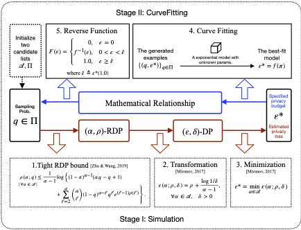
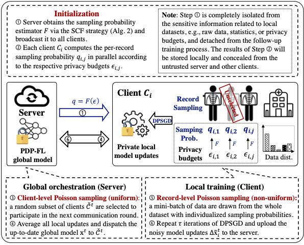

# rPDP-FL: Cross-silo Federated Learning with Record-level Personalized Differential Privacy

Code for CCS'24 paper: [Cross-silo Federated Learning with Record-level Personalized Differential Privacy](https://arxiv.org/pdf/2401.16251).

## Introduction
This open-source research library `myopacus` is an extension to the [Opacus](https://github.com/pytorch/opacus) library for training private models with **record-level personalized differential privacy (rPDP)** under the **federated learning** framework, where individual participants are allowed to set personalized, non-uniform privacy budgets that reflect their personal privacy preferences. 

We devise a novel framework named **rPDP-FL**, employing a two-stage hybrid sampling scheme with both *uniform client-level sampling* and *non-uniform record-level sampling* to accommodate varying privacy requirements. 
Then a critical problem is 
> how to select the ideal per-record sampling probability $q$ given the personalized privacy budget $\varepsilon$ ?

In this work, a versatile solution named **Simulation-CurveFitting (SCF)** is introduced.
As illustrated in the following figure, SCF aims to explore the mathematical relation between the sampling probabilities $q$ and the corresponding privacy budgets $\varepsilon$. It allows us to uncover a significant insight into the nonlinear correlation, and thus the per-record sampling probabilities can be derived given the pre-determined privacy budgets. 



It's worth highlighting that rPDP-FL *solely* alters the sampling processes (except for the initialization step) and remains detached from the intricacies associated with the learning process. This feature enables its broader applicability to any non-private FL or SGD-based algorithms that incorporate a two-stage sampling process, as illustrated in the following figure.



## Experimental settings

In this library, we simulate three potential personalized privacy scenarios (i.e., ThreeLevels, BoundedMixPareto and BoundedMixGauss), and conduct a comprehensive evaluation on four real-world datasets, including [the UCI Heart Disease](https://archive.ics.uci.edu/dataset/45/heart+disease), [MNIST](https://pytorch.org/vision/main/generated/torchvision.datasets.MNIST.html), [CIFAR10](https://pytorch.org/vision/main/generated/torchvision.datasets.CIFAR10.html), and [the Stanford Natural Language Inference (SNLI) Corpus](https://nlp.stanford.edu/projects/snli/).

We will show that our SCF strategy outperforms the existing PDP methods for centralized ML in model utility and computational efficiency. Additionally, we demonstrate that rPDP-FL significantly enhances the utility of the joint model compared to baseline methods that do not incorporate personalized privacy preservation. All figures showed in our CCS manuscript are stored in `./assets` folder.

# Getting started
The following instruction would work for Ubuntu 22.04 Linux users with NVIDIA GeForce RTX 4090 GPUs support. The model training process of all experiments is built on CUDA Toolkit 11.8 and cuDNN 8.9 for PyTorch 1.13.1.

## Create isolated Miniconda environment
First, please download and install the latest [Miniconda](https://docs.anaconda.com/free/miniconda/)  (a minimal version of Anaconda) version for your operating system.

Next, change directory (cd) into your preferred folder, then type:
```bash
conda create -n rpdp python=3.8
conda activate rpdp
conda install pytorch==1.13.1 torchvision==0.14.1 torchaudio==0.13.1 pytorch-cuda=11.7 -c pytorch -c nvidia
pip install -r requirements.txt
```

Then add all the path of all dependent modules to `PYTHONPATH` (in a manual or temporary way if you download this source code in ZIP format).
```bash
export PYTHONPATH=$PYTHONPATH:/your/path/rpdp_fl:/your/path/rpdp_fl/myopacus:/your/path/rpdp_fl/torchdp:/your/path/rpdp_fl/experiemnts
```

# Running Experiments

## Downloading and preprocessing instructions
To generate the federated datasets, users can first cd into the `dataset_creation_scripts` folder located in `./experiments/datasets/fed_*/`. For example, to split the MNIST dataset into ten independent and identically distributed (IID) subsets, users can simply run the following command:
```
cd /your/path/experiments/datasets/fed_mnist/dataset_creation_scripts
python iid.py
```
This will automatically download the original MNIST dataset and finish the process of partitioning. Note that the pre-processed [Fed-Heart-Disease](./experiments/datasets/fed_heart_disease/README.md) dataset has been provided in folder `./experiments/datasets/heart_disease` for your convenience.

## Experimental configurations and results
We also pre-specified some hyperparameter values for different experiments in folder `./experiments/configs/`.

## Top-level codes of our experiments
The top-level codes that start running the experiments displayed in our paper can be found in folder `./experiments/`. For example, in order to train a private model that achieves record-level personalied DP on the `Fed-Heart-Disease` dataset in the FL setting, users can run the Python file `fedavg_rpdp.py` as follows.
```bash
cd experiments
# dataset flags: {"heart_disease", "mnist", "cifar10", "snli"}
python fedavg_rpdp.py --dataset heart_disease --gpuid 0 --seed 42
```
We provide the estimated running time of each experiment for your reference:
- `LogisticRegression-HeartDisease` experiment: ~3 compute-minutes
- `DNN+mnist` experiment: ~30 compute-minutes
- `ResNet18-cifar10` experiment: ~7 compute-hours
- `BERT-SNLI` experiment: ~19 compute-hours

Besides, users can run the Python script `sgd_rpdp.py` to train a private model with rPDP on the pooled datasets in the centralized learning setting.
```bash
python sgd_rpdp.py --dataset heart_disease --gpuid 0 --seed 42
```

We also offer `fedavg/sgd_vanilla.py` and `fedavg/sgd_unidp.py` that respectively implement the vanilla FedAvg/SGD algorithm and the DP-FedAvg/DP-SGD algorithm (where all records in the training dataset share the same privacy budget) as baselines.

## Experimental results
All experimental results will be saved in folders `./experiments/results/fed_*`. Considering the produced experimental results could be affected by the specific hardware setup of the system, the raw outcomes corresponding to the figures displayed in our CCS manuscript will remain available in `./experiments/results/original_submission_results/` for reference purposes. Users can run the `plot_main.ipynb` for data visualization.

## Learn more
- [RDP & DP budget curve visualization](./experiments/tutorials/guidence_on_rdp_accountants.ipynb)
- [Why do we choose the exponential family as the sampling probability estimator](./experiments/tutorials/guidence_on_choosing_prob_estimator.ipynb)
- [How to estimate individual sampling probabilities for records with personalized privacy budgets](./experiments/tutorials/guidence_on_simulation_curvefitting_strategy_implementation.ipynb)
